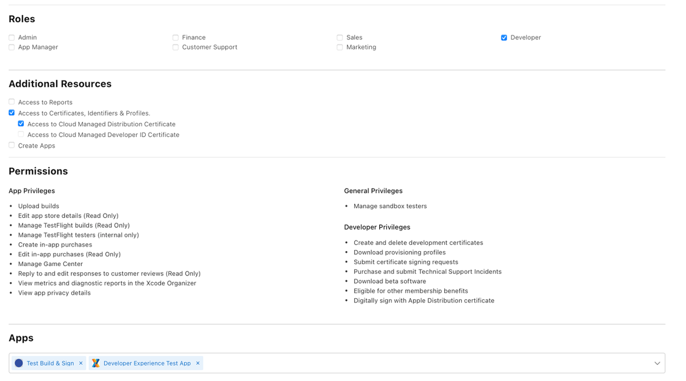
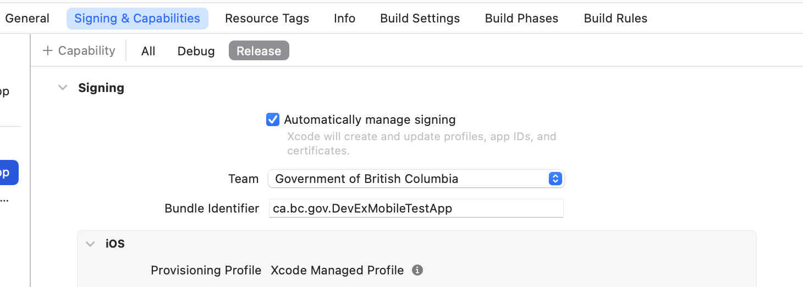

# Apple signing

This guide details how to work with apps signed by the Province's signing certificate. SaaS apps will be signed by the developer's own certificate. Refer to [Custom Apps](distribution_methods.md#apple-custom-app) for details on those apps.

To learn about code signing, review Apple's [code signing](https://help.apple.com/xcode/mac/current/#/devfbe995ebf) documentation. 

## Certificates
Apple provides 2 types of certificates:

* Development
* Distribution


Both certificate types need the app's [bundle id](https://developer.apple.com/documentation/appstoreconnectapi/bundle_ids). Remember, this was created during the project's onboarding phase. Talk to your Product or Technical Owner if you don't have the bundle id. 

 
### Development

Developer accounts are set up to have access to development certificates, identifiers and profiles. You can access them within Xcode by setting the team to the Province of BC. 

Review Apple's [Assign a project to a team](https://help.apple.com/xcode/mac/current/#/dev23aab79b4) documentation for details on how to do this. Turn on the "automatically manage signing" in the Signing and Capabilities -> Debug tab in XCode.

Developers may install the app on their own device. This can be [setup through Xcode](https://developer.apple.com/documentation/xcode/distributing-your-app-to-registered-devices#Register-devices-automatically-in-Xcode). Use [TestFlight](https://testflight.apple.com) if you need to test on many devices.

[Contact the Developer Experience](contact.md) team if you experience issues with the development certificate process.


### Distribution

You must use the Province of BC's signing certificate to distribute the app. This certificate is used when exporting the app to the AppStore and TestFlight. It also allows the app to use the [AdHoc distribution method](https://developer.apple.com/documentation/xcode/distributing-your-app-to-registered-devices). 

## CI/CD build
If your app's code is in the [bcgov GitHub organization](https://github.com/bcgov), then use a [GitHub Action](https://docs.github.com/en/actions) to build and sign your app. 

Contact the [Developer Experience team](contact.md) if you're using a different CI/CD pipeline. 

To use a GitHub Actions to build and sign your app:

1. Send your GitHub repo's name to the [Developer Experience team](contact.md). 
1. We will give it access to the following secrets:
  1. `APPLE_APP_STORE_BUILD_CERTIFICATE_BASE64`
  1. `APPLE_APP_STORE_BUILD_CERTIFICATE_PASSWD`
1. Create and download the provisioning profile for your app
1. Install the provisioning profile as a secret in your repo
  1. Refer to GitHub's [Installing an Apple certificate on macOS runners for Xcode development](https://docs.github.com/en/actions/deployment/deploying-xcode-applications/installing-an-apple-certificate-on-macos-runners-for-xcode-development) documentation for details
1. In the Signing & Capabilities -> Release tab in Xcode:
  1. Turn off "automatically manage signing" 
  1. Select the new provisioning profile in the "Provisioning Profile" drop-down box
1. Setup [export options](#exportoptionsplist)
1. Create [the GitHub Action](#example)


### exportOptions.plist

The `-exportArchive` flag on the `xcodebuild` command signs the app. This command also takes the `-exportOptionsPlist` flag. This `.plist` file contains configuration information for the build.

```xml
<?xml version="1.0" encoding="UTF-8"?>
<!DOCTYPE plist PUBLIC "-//Apple//DTD PLIST 1.0//EN" "http://www.apple.com/DTDs/PropertyList-1.0.dtd">
<plist version="1.0">
<dict>
	<key>teamID</key>
	<string>TEAM_ID_HERE</string>
	<key>method</key>
	<string>app-store</string>
	<key>signingStyle</key>
	<string>manual</string>
	<key>stripSwiftSymbols</key>
	<true/>
	<key>uploadBitcode</key>
	<false/>
	<key>uploadSymbols</key>
	<true/>
	<key>provisioningProfiles</key>
	<dict>
		<key>ca.bc.gov.YOUR_APP</key>
		<string>YOUR_APPS_UUID_STRING</string>
	</dict>
</dict>
</plist>
```

The `provisioningProfiles` string value is the provisioning profile's UUID. To get the UUID run the following command:

```shell
security cms -D -i your_provisiong_profile.mobileprovision
```

Look for the `UUID` key in the output. Its value is the provisioning profile's UUID. 

### Example

The [bc-wallet-mobile](https://github.com/bcgov/bc-wallet-mobile/blob/main/.github/workflows/main.yaml) project has a complete GitHub Action that builds an iOS app. Use it as a reference for your project.

This is a basic GitHub Action that builds and signs an app.

```yaml
name: Build
on: 
  push:
    branches: [ "main" ]
   
jobs:
  build-ios:
    name: Build and sign ios
    runs-on: macos-latest

    env:
      PROJECT: ${{ 'Your_App_Name.xcworkspace' }}
      SCHEME: ${{ 'Your_App_Name' }}
      DATA_DIR: ${{ 'xcbuild' }}
      ARCHIVE_NAME:  ${{ 'Your_App_Name.xcarchive' }}
      EXPORT_DIR: ${{ 'export' }}
      IPA_NAME: ${{ 'Your_App_Name.ipa' }}
    
    steps:
      - name: Checkout
        uses: actions/checkout@v3
      
      - name: Display XCode Path for debug
        run: |
          xcode-select -p  

      - name: Cache Pods
        uses: actions/cache@v3
        with:
          path: ios/Pods
          key: ${{ runner.os }}-pods-${{ hashFiles('**/Podfile.lock') }}
          restore-keys: |
            ${{ runner.os }}-pods-   
          
      - name: CocoaPod Install
        run: pod install 

      # from https://docs.github.com/en/enterprise-cloud@latest/actions/deployment/deploying-xcode-applications/installing-an-apple-certificate-on-macos-runners-for-xcode-development
      - name: Install the Apple certificate and provisioning profile
        env:
          # The first two keys are from the bcgov organization secrets
          BUILD_CERTIFICATE_BASE64: ${{ secrets.APPLE_APP_STORE_BUILD_CERTIFICATE_BASE64 }}
          P12_PASSWORD: ${{ secrets.APPLE_APP_STORE_BUILD_CERTIFICATE_PASSWD }}
          # These two keys are from your app's repo secrets
          BUILD_PROVISION_PROFILE_BASE64: ${{ secrets.IOS_PROVISION_PROFILE_BASE64 }}
          KEYCHAIN_PASSWORD: ${{ secrets.KEYCHAIN_PASSWORD }}
        run: |
          # create variables
          CERTIFICATE_PATH=$RUNNER_TEMP/build_certificate.p12
          PP_PATH=$RUNNER_TEMP/build_pp.mobileprovision
          KEYCHAIN_PATH=$RUNNER_TEMP/app-signing.keychain-db

          # import certificate and provisioning profile from secrets
          echo -n "$BUILD_CERTIFICATE_BASE64" | base64 --decode --output $CERTIFICATE_PATH
          echo -n "$BUILD_PROVISION_PROFILE_BASE64" | base64 --decode --output $PP_PATH

          # create temporary keychain
          security create-keychain -p "$KEYCHAIN_PASSWORD" $KEYCHAIN_PATH
          security set-keychain-settings -lut 21600 $KEYCHAIN_PATH
          security unlock-keychain -p "$KEYCHAIN_PASSWORD" $KEYCHAIN_PATH

          # import certificate to keychain
          security import $CERTIFICATE_PATH -P "$P12_PASSWORD" -A -t cert -f pkcs12 -k $KEYCHAIN_PATH
          security list-keychain -d user -s $KEYCHAIN_PATH

          # apply provisioning profile
          mkdir -p ~/Library/MobileDevice/Provisioning\ Profiles
          cp $PP_PATH ~/Library/MobileDevice/Provisioning\ Profiles    
    
      - name: Increment Build No.
        env:
          BUILD_NO: ${{ github.run_number }}
        run: |
          # Set Build Number. Not worrying about storing to repo.
          agvtool new-version -all ${BUILD_NO}

      - name: Build For Release
        run: |
          xcodebuild \
          -workspace $PROJECT \
          -scheme $SCHEME \
          -configuration Release \
          -sdk iphoneos \
          -derivedDataPath $DATA_DIR \
          -archivePath ${DATA_DIR}/${ARCHIVE_NAME} \
          archive

      - name: Export Archive 
        # This is the step that signs the build
        run: |
          xcodebuild \
          -exportArchive \
          -archivePath ${DATA_DIR}/${ARCHIVE_NAME} \
          -exportPath $EXPORT_DIR \
          -exportOptionsPlist exportOptions.plist \
          -verbose
      
      - name: Upload a Build Artifact
        uses: actions/upload-artifact@v3
        with:
          name: ios-release
          path: ${{ env.EXPORT_DIR }}
          if-no-files-found: error
          retention-days: 5
```

## Laptop build
Are you releasing your app from a developer's laptop? Use XCode's "automatically manage signing" feature to sign your app. 

There are 2 steps to enable this feature:

### 1. App Manager steps

1. Sign into [App Store Connect](https://appstoreconnect.apple.com/login)
1. Go to the [Users and Access](https://appstoreconnect.apple.com/access/users) tab
1. Click on the developer who will sign the build
1. Check the "Access to Cloud Managed Distribution Certificate" option under the "Additional Resources" section
1. Repeat steps 3 - 4 for other developers who can sign the build
1. [Contact the Developer Experience team](contact.md) if there are issues assigning access to the developer



### 2. Developer steps

After the App Manager has given you the permissions in the above step, go into XCode:

1. Navigate to the "Signing & Capabilities" screen
1. Select "Automatically manage signing"
1. Select "Government of British Columbia" as the team




We encourage you to use a CI/CD pipeline to build and release your app. It allows for repeatable builds and removes reliance on a developer's computer.


## Provisioning profiles

Provisioning profiles links the bundle id with a certificate and optional associated devices. As with certificates, there are also development and distribution provisioning profiles.


